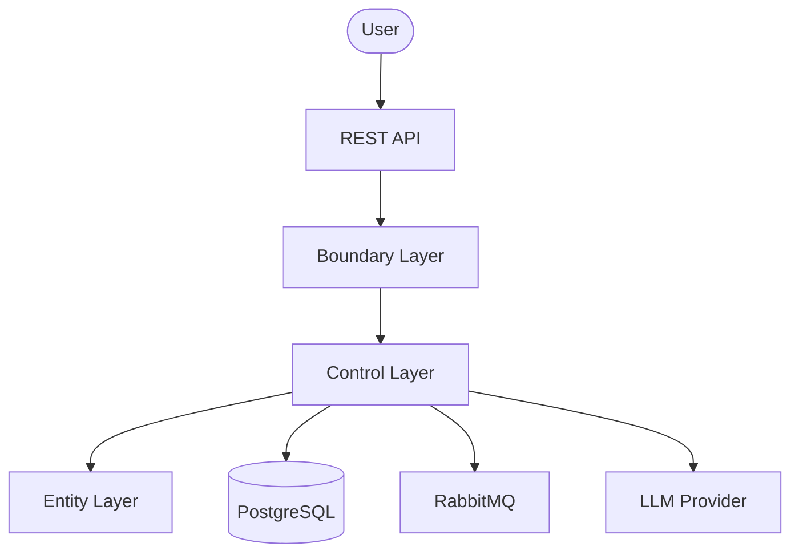

# Arc42 Skill

Creates or updates arc42 architecture documentation based on project analysis and a structured interview.

> **Philosophy:** Architecture documentation lives with the code. Arc42 sections are filled
> from actual project artifacts – not from assumptions. Only ask what cannot be derived automatically.

---

## What This Skill Does

1. **Analyzes the project** – evaluates pom.xml, source code, specs, docker-compose, properties
2. **Asks for language** – German (DE) or English (EN)
3. **Fills gaps via interview** – only asks what cannot be derived from code
4. **Creates or updates** – `docs/arc42/<artifactId>-arc42.md` from template

## How to Use

```
Create arc42 documentation for my project
```

```
Update the arc42 docs with the new messaging feature
```

```
Document the architecture in English
```

```
arc42 for my Quarkus project
```

---

## Instructions

> **Before every generation:**
> 1. Check `.claude/lessons-learned.md`
> 2. Read existing `docs/arc42/<artifactId>-arc42.md` if present (update mode)

### Step 1 – Analyze Project (automatic)

Before the interview, read and evaluate existing project artifacts:

| File / Directory | Extracted Information | Arc42 Section |
|-----------------|----------------------|---------------|
| `pom.xml` | groupId, artifactId, framework, dependencies, Java version | 1 (Intro), 4 (Strategy), 9 (Decisions) |
| `src/main/resources/application.properties` or `application.yml` | Ports, DB config, messaging, auth, AI | 3 (Context), 7 (Deployment) |
| `docker-compose.yml` | Services, ports, infrastructure | 7 (Deployment) |
| `specs/*.md` | Feature specifications, business requirements | 1 (Goals), 3 (Context) |
| `src/main/java/**/boundary/rest/` | REST endpoints (paths, methods, DTOs) | 3 (Context), 5 (Building Blocks), 6 (Runtime) |
| `src/main/java/**/boundary/messaging/` | Messaging consumers/producers | 3 (Context), 5 (Building Blocks) |
| `src/main/java/**/boundary/ai/` | AI Services (LangChain4j) | 5 (Building Blocks), 8 (Concepts) |
| `src/main/java/**/control/` | Services, business logic, AI tools | 5 (Building Blocks) |
| `src/main/java/**/entity/` | Entities, domain model | 5 (Building Blocks) |
| `src/main/resources/db/migration/` | Flyway migrations → DB schema | 5 (Building Blocks), 8 (Concepts) |
| `src/test/java/**/*ArchitectureTest*` | Taikai rules → architecture constraints | 2 (Constraints), 9 (Decisions) |
| `Dockerfile` / `Helm/` | Container config, deployment strategy | 7 (Deployment) |
| `renovate.json` | Dependency management strategy | 8 (Concepts) |
| `docs/*.md` | Existing documentation | All sections |

Already determined information **must not be asked again**.

### Step 2 – Language Selection

Ask the user for the documentation language:

| Option | Template Base | Output Language |
|--------|--------------|-----------------|
| **Deutsch (DE)** | `templates/arc42-template-DE-plain-markdown/arc42-template-DE.md` | German headings and prose |
| **English (EN)** | Same template, translated headings | English headings and prose |

If the user already specified the language (e.g. "arc42 in English"), skip this question.

### Step 3 – Interview (only fill gaps)

Only ask what cannot be clearly derived from the source code.
Ask all questions at once using a structured format:

| # | Question | Arc42 Section | Only ask when |
|---|----------|---------------|---------------|
| 1 | **Brief system description** (1–2 sentences: what does it do, for whom?) | 1 – Introduction | No README or spec present |
| 2 | **Key quality goals** (top 3: e.g. performance, security, maintainability) | 1 – Quality Goals | Not derivable from tests/specs |
| 3 | **Stakeholders** (who uses it, who decides, who operates?) | 1 – Stakeholders | Always ask |
| 4 | **Architecture constraints** (organizational, technical, regulatory) | 2 – Constraints | Always ask |
| 5 | **External systems** (which systems does it interact with?) | 3 – Context | Not fully derivable from code |
| 6 | **Key architecture decisions** (why this framework, why this DB, why this pattern?) | 9 – Decisions | Always ask – decisions have reasons |
| 7 | **Known risks and technical debt** | 11 – Risks | Always ask |
| 8 | **Should all 12 sections be filled?** | All | Always ask – some sections may be omitted |

### Step 4 – Generate Arc42 Document

**Create mode:** `docs/arc42/<artifactId>-arc42.md` does not exist
→ Generate from template, fill all confirmed sections with analyzed + interviewed content.

**Update mode:** `docs/arc42/<artifactId>-arc42.md` already exists
→ Read file, update changed/new sections only.
→ **Do not overwrite** manually added content by the user.
→ Add update note: `_Last updated: {{DATE}} (arc42)_`

#### Section Mapping

| Arc42 Section | Source | Required |
|---------------|--------|----------|
| **1. Introduction and Goals** | Interview + specs + README | Yes |
| **2. Architecture Constraints** | Interview + Taikai tests + pom.xml | Yes |
| **3. Context and Scope** | REST endpoints, messaging, external systems | Yes |
| **4. Solution Strategy** | Framework choice, patterns (BCE), dependencies | Yes |
| **5. Building Block View** | Package structure (boundary/control/entity) | Yes |
| **6. Runtime View** | REST flows, messaging flows, AI interactions | If endpoints present |
| **7. Deployment View** | Dockerfile, docker-compose, Helm | If infra present |
| **8. Cross-cutting Concepts** | Persistence (Flyway), Auth (Keycloak), AI (LangChain4j), Messaging | Yes |
| **9. Architecture Decisions** | Interview + detected patterns | Yes |
| **10. Quality Requirements** | Quality goals + Taikai rules | Yes |
| **11. Risks and Technical Debt** | Interview | Yes |
| **12. Glossary** | Domain terms from entities and specs | If entities present |

#### Building Block View (Section 5) – Generation Rules

The Building Block View is the most code-dependent section. Generate it as follows:

**Level 1 – Whitebox Overall System:**
- One box per BCE layer (Boundary, Control, Entity)
- External systems as black boxes (DB, RabbitMQ, Keycloak, LLM Provider)
- Use Mermaid diagrams for visualization

**Level 2 – Per Layer:**
- Boundary: List REST endpoints, messaging consumers, AI services
- Control: List services, AI tools, RAG components
- Entity: List JPA entities with key attributes

**Mermaid Diagrams:**
Generate Mermaid diagrams for:
- Context diagram (Section 3)
- Building block overview (Section 5)
- Key runtime scenarios (Section 6)
- Deployment overview (Section 7)

Example:


### Step 5 – Trigger Background Updates

After creating the initial arc42 document, inform the user:

> The **arc42-updater** agent can automatically update sections when architecture
> changes occur. Other skills (java-scaffold, openapi, infrastructure) can trigger
> it after code generation.

---

## References

| File | Description |
|------|-------------|
| `.claude/lessons-learned.md` | Findings and corrections – check before every generation |
| [templates/arc42-template-DE-plain-markdown/arc42-template-DE.md](templates/arc42-template-DE-plain-markdown/arc42-template-DE.md) | German Markdown template (arc42 v9.0) |
| [templates/arc42-template-DE-plain-html/arc42-template.html](templates/arc42-template-DE-plain-html/arc42-template.html) | German HTML template (reference only) |

### Output Path

```
docs/arc42/<artifactId>-arc42.md
```

The `docs/arc42/` directory is created if it does not exist.

---

## Conventions

- **Language:** Selectable – German or English (headings and prose)
- **Filename:** `<artifactId>-arc42.md` in kebab-case
- **Format:** Markdown with Mermaid diagrams
- **Diagrams:** Mermaid syntax (rendered by GitHub, GitLab, IDE plugins)
- Version numbers taken from `pom.xml` – no guessing
- Passwords / secrets only as placeholders (`<your-secret>`) – never real values
- **Co-Author:** `<!-- Generated via arc42 · Co-Author: Claude (claude-sonnet-4-6, Anthropic) -->`

### Position in Workflow

```
[spec-feature]      optional – business requirements
        |
[openapi]           if OpenAPI spec available
        |
[java-scaffold]     application: pom.xml, BCE, AI, Flyway
        |
[infrastructure]    Dockerfile, docker-compose, Helm
        |
[arc42]             <-- architecture documentation
        |
[review]            code review
        |
[doc]               project documentation (complements arc42)
```

### Relationship to doc Skill

| Aspect | arc42 | doc |
|--------|-------|-----|
| **Focus** | Architecture decisions, structure, quality | Developer onboarding, API reference, setup |
| **Audience** | Architects, tech leads, reviewers | Developers, operators |
| **Template** | arc42 (12 sections) | Custom project template |
| **Diagrams** | Mermaid (context, building blocks, deployment) | Minimal |
| **Updates** | On architecture changes (via arc42-updater agent) | On feature/API changes |

Both complement each other – arc42 is the "why and how" of architecture, doc is the "how to use and run".
