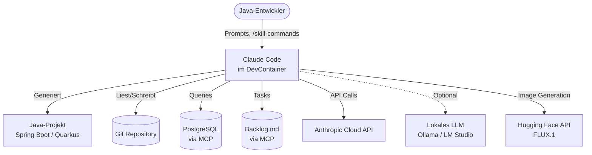
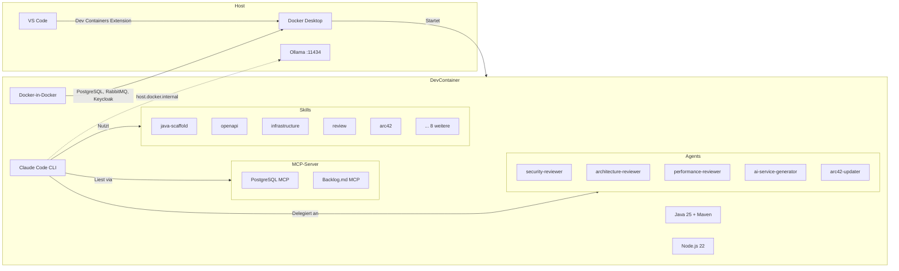
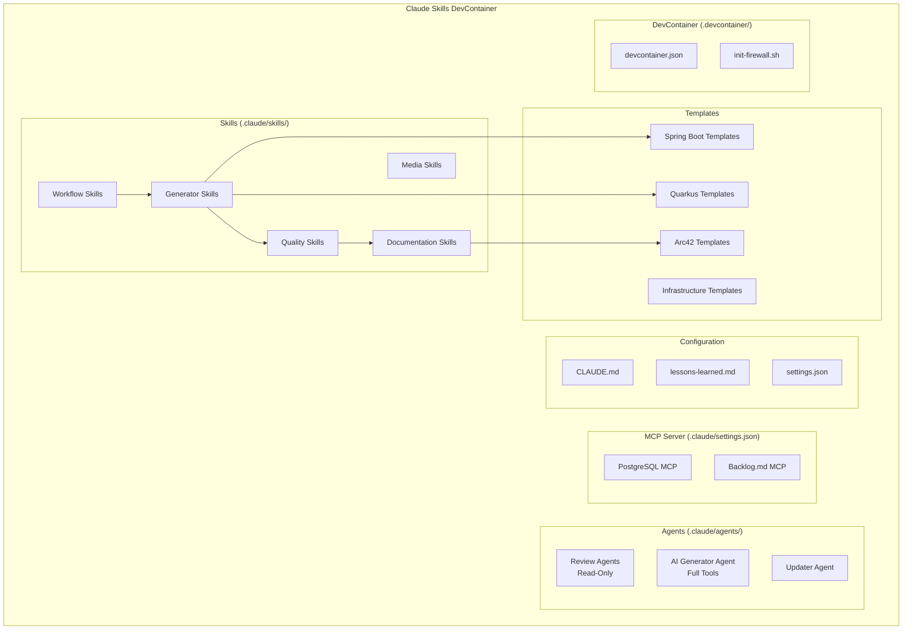
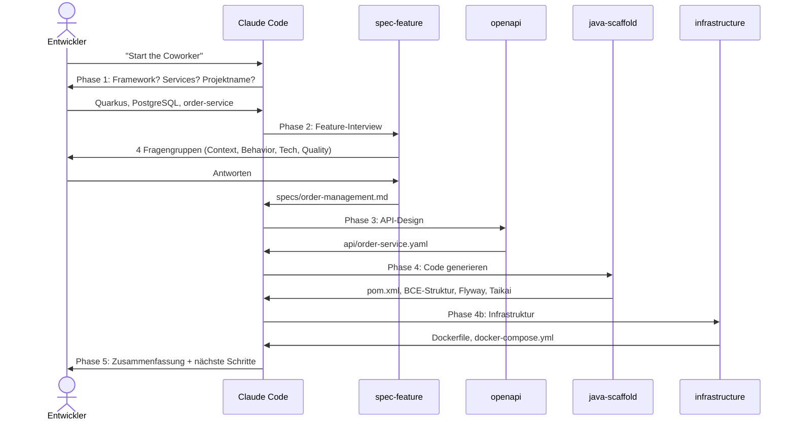
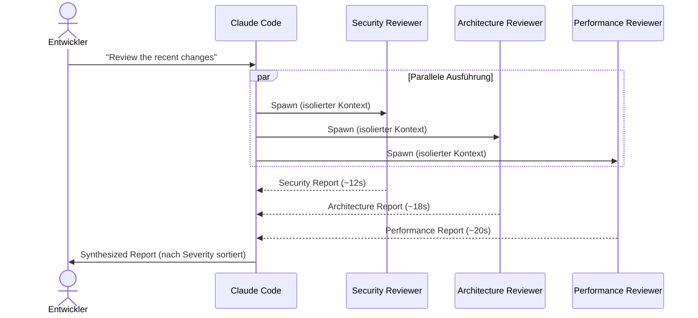
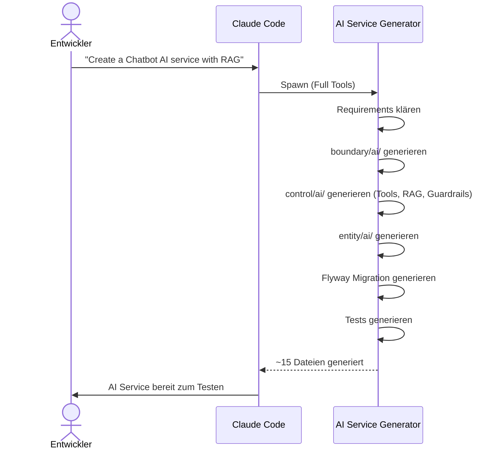
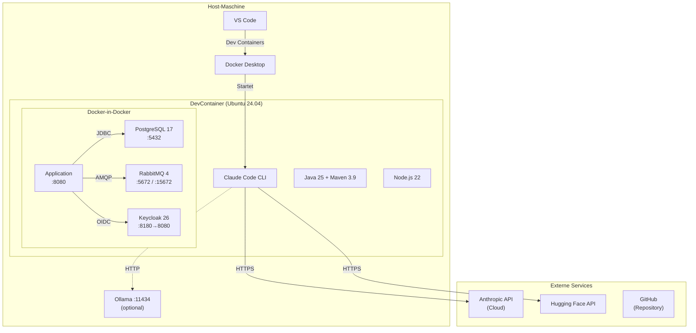
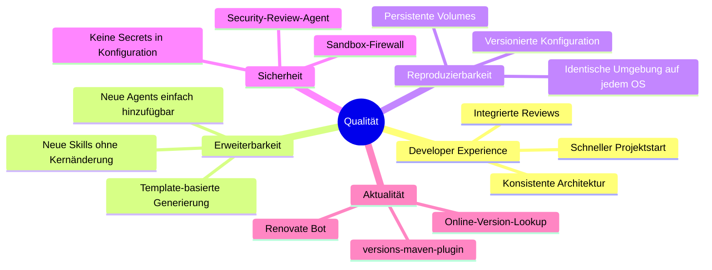

<!-- Generated via arc42 · Co-Author: Claude (claude-opus-4-6, Anthropic) -->
<!-- arc42 Template Version 9.0-DE, basiert auf https://arc42.org -->
<!-- _Last updated: 2026-03-19 (arc42)_ -->

# Arc42 – Claude Skills DevContainer

## Über arc42

arc42, das Template zur Dokumentation von Software- und Systemarchitekturen.
Template Version 9.0-DE. Created, maintained and (c) by Dr. Peter Hruschka,
Dr. Gernot Starke and contributors. Siehe <https://arc42.org>.

---

# 1. Einführung und Ziele
## 1.1 Aufgabenstellung
Das **Claude Skills DevContainer** ist ein vorkonfiguriertes DevContainer-Template
für AI-gestützte Java-Entwicklung mit Claude Code. Es bietet spezialisierte Skills,
Sub-Agents und MCP-Integrationen für den gesamten Entwicklungszyklus — von
Anforderungen (Spec) über Code-Generierung (Scaffold) bis hin zu Deployment
(Infrastructure) und Dokumentation (Arc42, Doc).

**Kernfunktionen:**

- **13 Skills** decken den kompletten Workflow ab: Spezifikation, API-Design,
  Code-Generierung, Infrastruktur, Review, Dokumentation und mehr
- **5 Sub-Agents** für parallele Code-Reviews (Security, Architecture, Performance)
  und AI-Service-Generierung
- **MCP-Integrationen** für PostgreSQL und Backlog.md
- **Unterstützung lokaler LLMs** (Ollama, LM Studio) für datensouveräne Entwicklung
- **Zwei Frameworks:** Spring Boot 4.x und Quarkus 3.31+ mit Java 25

## 1.2 Qualitätsziele
| Priorität | Qualitätsziel | Beschreibung |
|-----------|--------------|--------------|
| 1 | **Developer Experience** | Ein Entwickler soll innerhalb von Minuten ein lauffähiges Java-Projekt mit allen Best Practices generieren können |
| 2 | **Erweiterbarkeit** | Neue Skills und Agents können ohne Änderungen am Kern hinzugefügt werden |
| 3 | **Reproduzierbarkeit** | Jeder Entwickler erhält die identische Umgebung — unabhängig vom Host-Betriebssystem |

## 1.3 Stakeholder
| Rolle | Kontakt | Erwartungshaltung |
|-------|---------|-------------------|
| Java-Entwickler | Endanwender | Schneller Projektstart, konsistente Architektur, AI-Unterstützung |
| Software-Architekt | Endanwender | BCE-Pattern-Compliance, Architecture-as-Code, Arc42-Dokumentation |
| Template-Maintainer | Repository-Owner | Einfache Pflege, modulare Skill-Struktur, versionierbare Konfiguration |
| DevOps-Engineer | Endanwender | Reproduzierbare Container-Umgebung, Infrastructure-as-Code |

---

# 2. Randbedingungen
## 2.1 Technische Randbedingungen

| Randbedingung | Begründung |
|---------------|------------|
| Docker Desktop erforderlich | DevContainer basiert auf Docker; Docker-in-Docker für Infrastruktur-Skills |
| VS Code + Dev Containers Extension | Primäre IDE; Claude Code Extension integriert |
| Node.js 22 im Container | MCP-Server (npx) und Claude Code CLI benötigen Node.js |
| Java 25 (Microsoft OpenJDK) | Aktuelle LTS-Version; Spring Boot 4.x und Quarkus 3.31+ erfordern Java 25 |
| Maven 3.9.x | Build-Tool für alle generierten Java-Projekte |

## 2.2 Organisatorische Randbedingungen

| Randbedingung | Begründung |
|---------------|------------|
| Open Source (GitHub) | Template soll frei nutzbar und erweiterbar sein |
| Conventional Commits | `feat:`, `fix:`, `docs:`, `chore:` — einheitliches Commit-Format |
| Feature Branches | Keine direkten Commits auf `main` |
| Englisch in Code/Docs | Internationale Nutzbarkeit |

## 2.3 Konventionen

| Konvention | Beschreibung |
|------------|--------------|
| BCE-Pattern | Boundary / Control / Entity — verpflichtend für alle generierten Projekte |
| Taikai Architecture Tests | Automatische Architektur-Validierung (basiert auf ArchUnit) |
| Flyway Migrations | Schema-Management — kein `ddl-auto=create` |
| Health Checks | `/actuator/health` (Spring) bzw. `/q/health` (Quarkus) — Pflicht |
| Co-Author-Vermerk | Jede generierte Datei enthält einen Claude Co-Author-Hinweis |

---

# 3. Kontextabgrenzung
## 3.1 Fachlicher Kontext


| Externe Schnittstelle | Beschreibung |
|-----------------------|-------------|
| **Anthropic Cloud API** | Claude-Modelle (Sonnet, Opus) für Code-Generierung und Reviews |
| **Lokales LLM** (optional) | Ollama oder LM Studio für datensouveräne Nutzung |
| **Hugging Face API** | FLUX.1-schnell für Infografik-Generierung (Skill: infografik) |
| **Git Repository** | Versionskontrolle; Feature-Branches, Conventional Commits |
| **Docker Hub / GHCR** | Container-Images für DevContainer-Features und Infrastruktur |

## 3.2 Technischer Kontext


| Technische Schnittstelle | Protokoll / Port | Beschreibung |
|--------------------------|-----------------|-------------|
| Anthropic API | HTTPS | `ANTHROPIC_API_KEY` oder `claude login` |
| PostgreSQL MCP | TCP :5432 | `@modelcontextprotocol/server-postgres` |
| Backlog.md MCP | Stdio | `mcp-backlog-md` |
| Ollama (optional) | HTTP :11434 | Via `host.docker.internal` |
| LM Studio (optional) | HTTP :1234 | Via `host.docker.internal` |
| Hugging Face | HTTPS | `HF_TOKEN` für Infografik-Skill |
| Docker-in-Docker | Unix Socket | Für `docker compose` in generierten Projekten |

---

# 4. Lösungsstrategie
| Entscheidung | Begründung |
|-------------|------------|
| **DevContainer** als Auslieferungsformat | Reproduzierbare Umgebung; keine lokale Installation nötig außer Docker + VS Code |
| **Skills statt Plugins** | Markdown-basiert, versionierbar in Git, keine Kompilierung nötig; folgt dem [Agent Skills Open Standard](https://agentskills.io) |
| **Sub-Agents für Reviews** | Parallele Ausführung (3 Reviews in ~25s statt ~55s sequentiell); isolierter Kontext schützt die Hauptkonversation |
| **MCP für Datenquellen** | Standardisiertes Protokoll; Claude kann direkt SQL-Queries an PostgreSQL senden |
| **BCE-Pattern** | Klare Schichtentrennung; automatisch prüfbar via Taikai |
| **Zwei Frameworks** (Spring Boot + Quarkus) | Abdeckung der beiden größten Java-Framework-Ökosysteme |
| **Versions-Lookup online** | Verhindert veraltete Dependencies; jeder Scaffold nutzt aktuelle Versionen |
| **Lessons Learned** als zentrale Wissensbasis | `.claude/lessons-learned.md` wird vor jeder Generierung gelesen; verhindert bekannte Fehler |

---

# 5. Bausteinsicht
## 5.1 Whitebox Gesamtsystem


### Workflow Skills

| Skill | Verantwortung | Trigger |
|-------|--------------|---------|
| `coworker` | End-to-End-Projektsetup in 5 Phasen mit Review | `Start the Coworker` |
| `spec-feature` | Strukturiertes Feature-Interview → `specs/*.md` | `Specify a feature` |

### Generator Skills

| Skill | Verantwortung | Trigger |
|-------|--------------|---------|
| `java-scaffold` | pom.xml, BCE-Struktur, Flyway, Taikai, AI Services | `Create a new project` |
| `openapi` | OpenAPI 3.x Specs erstellen, erweitern, Code generieren | `Create an API spec` |
| `infrastructure` | Dockerfile, docker-compose, Helm Charts | `Create a Dockerfile` |
| `frontend` | HTML-Seiten, Dashboards (TailAdmin), Landing Pages | `Create a dashboard` |

### Quality Skills

| Skill | Verantwortung | Trigger |
|-------|--------------|---------|
| `review` | Code-Review gegen Konventionen und BCE-Regeln | `Review the code` |
| `skill-creator` | Skills erstellen, optimieren, Evals messen | `Create a new skill` |

### Documentation Skills

| Skill | Verantwortung | Trigger |
|-------|--------------|---------|
| `arc42` | Arc42-Architekturdokumentation (DE/EN) | `Create arc42 docs` |
| `doc` | Projektdokumentation (`docs/*.md`) | `Document the project` |
| `blog-post` | Technische Blog-Posts mit Zielgruppenanpassung | `/blog-post` |

### Media Skills

| Skill | Verantwortung | Trigger |
|-------|--------------|---------|
| `infografik` | PNG-Infografiken via Hugging Face FLUX.1 | `Create an infographic` |

## 5.2 Ebene 2 — Sub-Agents
### Review Agents (Read-Only)

| Agent | Fokus | Tools |
|-------|-------|-------|
| `security-reviewer` | Secrets, Auth, Input Validation, OWASP | Read, Grep, Glob, Bash |
| `architecture-reviewer` | BCE-Compliance, Taikai, Package-Struktur | Read, Grep, Glob, Bash |
| `performance-reviewer` | N+1 Queries, Blocking, Memory Leaks | Read, Grep, Glob, Bash |

### Generator Agent

| Agent | Fokus | Tools |
|-------|-------|-------|
| `ai-service-generator` | LangChain4j AI Services mit Tools, RAG, Guardrails | Read, Write, Edit, Bash, Glob, Grep |

### Updater Agent

| Agent | Fokus | Tools |
|-------|-------|-------|
| `arc42-updater` | Automatische Arc42-Updates nach Architekturänderungen | Read, Grep, Glob, Bash |

## 5.3 Ebene 2 — DevContainer-Konfiguration

```
.devcontainer/
├── devcontainer.json          # Container-Definition, Features, Ports, Volumes
└── init-firewall.sh           # iptables-Firewall (Sandbox)
```

**Features im Container:**

| Feature | Version | Zweck |
|---------|---------|-------|
| `claude-code` | latest | Claude Code CLI + VS Code Extension |
| `java` | 25 (MS OpenJDK) | Java-Entwicklung |
| `python` | 3.12 | Hilfsskripte |
| `node` | 22 | MCP-Server (npx), Claude Code |
| `docker-in-docker` | latest | Container für generierte Infrastruktur |

**Persistente Volumes:**

| Volume | Mount | Zweck |
|--------|-------|-------|
| `claude-code-config` | `/root/.claude` | Claude Code Sessions und Konfiguration |
| `claude-code-m2` | `/root/.m2` | Maven-Cache (überlebt Container-Rebuilds) |

---

# 6. Laufzeitsicht
## 6.1 Szenario: Neues Java-Projekt erstellen (Coworker-Workflow)



## 6.2 Szenario: Paralleler Code-Review



## 6.3 Szenario: AI Service generieren



---

# 7. Verteilungssicht
## 7.1 Infrastruktur Ebene 1


**Port-Mapping:**

| Port | Service | Beschreibung |
|------|---------|-------------|
| 8080 | Application | Spring Boot / Quarkus (forwarded) |
| 8180 | Keycloak | Admin Console + OIDC Endpoints (forwarded) |
| 5432 | PostgreSQL | Datenbank (intern) |
| 5672 | RabbitMQ | AMQP (intern) |
| 15672 | RabbitMQ | Management UI (intern) |

## 7.2 Infrastruktur Ebene 2 — DevContainer-Konfiguration

### DevContainer Features

Das DevContainer-Image basiert auf `mcr.microsoft.com/devcontainers/base:ubuntu-24.04`
und wird durch folgende Features erweitert:

| Feature | Quelle | Zweck |
|---------|--------|-------|
| claude-code | `ghcr.io/anthropics/devcontainer-features/claude-code:1` | CLI + Extension |
| java | `ghcr.io/devcontainers/features/java:1` | JDK 25, Maven 3.9.9 |
| python | `ghcr.io/devcontainers/features/python:1` | Python 3.12 |
| node | `ghcr.io/devcontainers/features/node:1` | Node.js 22 |
| docker-in-docker | `ghcr.io/devcontainers/features/docker-in-docker:2` | Docker + Compose v2 |

### Sandbox-Firewall

`init-firewall.sh` wird bei jedem Container-Start ausgeführt (`postStartCommand`)
und konfiguriert iptables-Regeln. Der Container benötigt `NET_RAW` Capability dafür.

---

# 8. Querschnittliche Konzepte
## 8.1 Skill-System

Skills sind Markdown-Dateien in `.claude/skills/`, die Claude Code als Anweisungen lädt.
Sie folgen dem [Agent Skills Open Standard](https://agentskills.io):

```
.claude/skills/<skill-name>/
├── SKILL.md              # Hauptanweisungen (max 500 Zeilen)
├── templates/            # Ausgabe-Templates
├── references/           # Referenzmaterial
└── examples/             # Beispielausgaben
```

**Aufruf:** Automatisch durch Beschreibungs-Matching oder direkt via `/skill-name`.

## 8.2 Sub-Agent-Architektur

Sub-Agents laufen in **isoliertem Kontext** — sie erhalten ein eigenes
Conversation-Window mit eingeschränkten Tools. Vorteile:

- **Parallelität:** 3 Review-Agents gleichzeitig (~25s statt ~55s)
- **Kontextschutz:** Hauptkonversation bleibt schlank
- **Spezialisierung:** Jeder Agent hat einen fokussierten System-Prompt

## 8.3 Versions-Management

Dependency-Versionen werden **niemals aus dem Gedächtnis** verwendet:

1. **Online-Lookup** vor jeder Generierung (mvnrepository.com, central.sonatype.com)
2. **versions-maven-plugin** im generierten `pom.xml` für lokale Prüfung
3. **renovate.json** im Projekt-Root für automatische Update-PRs

## 8.4 MCP-Integrationen (Model Context Protocol)

| MCP-Server | Paket | Zweck |
|------------|-------|-------|
| PostgreSQL | `@modelcontextprotocol/server-postgres` | SQL-Queries in natürlicher Sprache |
| Backlog.md | `mcp-backlog-md` | Task-Management mit User-Story-Format |

## 8.5 Persistenz-Strategie (generierte Projekte)

- **Flyway** für Schema-Management — kein `ddl-auto=create`
- Initiale Migration (`V1__create_*.sql`) für jede Entity Pflicht
- `ddl-auto=validate` prüft Schema-Konsistenz beim Start

## 8.6 Authentifizierung (generierte Projekte)

- **Keycloak 26** als IAM-Provider
- Spring Boot: `spring-boot-starter-oauth2-resource-server` (JWT)
- Quarkus: `quarkus-oidc` (OIDC Service Application)
- Dev-Modus: Keycloak mit H2-Datenbank, `admin/admin`

## 8.7 AI-Integration (generierte Projekte)

- **Quarkus LangChain4j** für AI Services
- BCE-konforme Architektur: `boundary/ai/` (Services), `control/ai/` (Tools, RAG, Guardrails)
- Provider: OpenAI, Ollama, Anthropic
- RAG: PgVector für Embedding-Speicher
- Guardrails: `dev.langchain4j.guardrail.InputGuardrail` / `OutputGuardrail`

## 8.8 Lessons Learned

`.claude/lessons-learned.md` ist die zentrale Wissensbasis:

- Wird vor **jeder** Generierung gelesen
- Enthält Korrekturen, Anti-Patterns und Framework-Spezifika
- Wächst mit dem Projekt — verhindert wiederholte Fehler

---

# 9. Architekturentscheidungen
| # | Entscheidung | Begründung | Alternativen |
|---|-------------|------------|-------------|
| ADR-1 | **DevContainer** als Auslieferungsformat | Reproduzierbare Umgebung auf jedem OS; kein lokales Setup nötig | VM-Image, Installationsskript |
| ADR-2 | **Claude Code** als AI-Engine | Tiefe IDE-Integration, MCP-Support, Agent-Architektur, Skill-System | GitHub Copilot, Cursor, Cody |
| ADR-3 | **Skills als Markdown** (nicht Plugins) | Versionierbar in Git, keine Kompilierung, einfach erweiterbar; Agent Skills Open Standard | Plugin-System, CLI-Tools |
| ADR-4 | **BCE-Pattern** für generierte Projekte | Klare Schichtentrennung, automatisch testbar via Taikai | Hexagonal, Onion, Layered |
| ADR-5 | **Zwei Frameworks** (Spring Boot + Quarkus) | Abdeckung der beiden größten Java-Ökosysteme | Nur ein Framework |
| ADR-6 | **Online-Version-Lookup** statt fest kodierter Versionen | Verhindert veraltete Dependencies in Templates | Feste Versionen mit regelmäßigem Update |
| ADR-7 | **Lokale LLM-Unterstützung** (Ollama, LM Studio) | Datensouveränität; Offline-Entwicklung möglich | Nur Cloud API |
| ADR-8 | **Backlog.md** als Task-Management | Local-first, Git-basiert, MCP-integriert, User-Story-Format | Jira, Linear, GitHub Issues |

---

# 10. Qualitätsanforderungen
## 10.1 Übersicht der Qualitätsanforderungen



## 10.2 Qualitätsszenarien

| # | Szenario | Qualitätsmerkmal | Erwartung |
|---|----------|-----------------|-----------|
| QS-1 | Entwickler startet den DevContainer zum ersten Mal | Developer Experience | Innerhalb von 5 Minuten ist die Umgebung bereit |
| QS-2 | Entwickler führt `/java-scaffold` aus | Reproduzierbarkeit | Generiertes Projekt kompiliert und besteht Architektur-Tests |
| QS-3 | Maintainer erstellt einen neuen Skill | Erweiterbarkeit | Nur `SKILL.md` + Eintrag in CLAUDE.md nötig; kein Rebuild |
| QS-4 | Entwickler wechselt von Cloud API zu lokalem LLM | Flexibilität | Nur 2 Environment-Variablen ändern + Container rebuild |
| QS-5 | 3 Review-Agents laufen parallel | Performance | Gesamtdauer < 30 Sekunden statt > 50 Sekunden sequentiell |

---

# 11. Risiken und technische Schulden
| # | Risiko / Schuld | Beschreibung | Maßnahme |
|---|----------------|--------------|----------|
| R-1 | **Vendor Lock-in (Anthropic)** | Skills und Agents sind auf Claude Code zugeschnitten | Lokale LLM-Unterstützung als Fallback; Skill-Format folgt offenem Standard |
| R-2 | **Keine automatisierten Tests für Skills** | Skills werden nicht automatisch getestet; Fehler fallen erst bei Nutzung auf | Skill-Creator bietet Eval-Funktionalität; CI/CD-Integration geplant |
| R-3 | **Template-Versioning** | Wenn sich Framework-Konventionen ändern, können Templates veralten | Online-Version-Lookup; lessons-learned.md als Korrektur-Mechanismus |
| R-4 | **Kontextfenster-Limitierung** | Große Projekte können das Claude-Kontextfenster überlasten | Sub-Agents mit isoliertem Kontext; automatische Komprimierung |
| R-5 | **Docker-in-Docker Komplexität** | DinD kann zu Netzwerk- und Performance-Problemen führen | Firewall-Script; NET_RAW Capability; Quarkus Dev Services deaktiviert |
| R-6 | **MCP-Server-Stabilität** | MCP-Server (npx) können bei npm-Problemen ausfallen | Fehler werden geloggt; MCP ist optional, nicht blockierend |

---

# 12. Glossar
| Begriff | Definition |
|---------|-----------|
| **BCE** | Boundary / Control / Entity — Architekturmuster für Schichtentrennung |
| **Claude Code** | CLI-Tool und VS Code Extension von Anthropic für AI-gestützte Entwicklung |
| **DevContainer** | Standardisierte, containerisierte Entwicklungsumgebung (VS Code / GitHub Codespaces) |
| **MCP** | Model Context Protocol — offenes Protokoll für die Anbindung von Datenquellen an LLMs |
| **Skill** | Markdown-basierte Anweisung in `.claude/skills/`, die Claude Code für spezifische Aufgaben steuert |
| **Sub-Agent** | Isolierter Claude-Code-Prozess mit eigenem Kontext und eingeschränkten Tools |
| **Taikai** | Architektur-Test-Framework basierend auf ArchUnit; prüft BCE-Compliance automatisch |
| **Flyway** | Datenbank-Migrationstool; verwaltet Schema-Änderungen über versionierte SQL-Dateien |
| **LangChain4j** | Java-Framework für LLM-Integration; in Quarkus via Quarkiverse-Extensions |
| **Conventional Commits** | Commit-Nachrichtenformat: `feat:`, `fix:`, `docs:`, `chore:` |
| **Renovate** | Bot für automatische Dependency-Update-PRs auf GitHub/GitLab |
| **Agent Skills Standard** | Offener Standard für AI-Agent-Skills (agentskills.io) |
