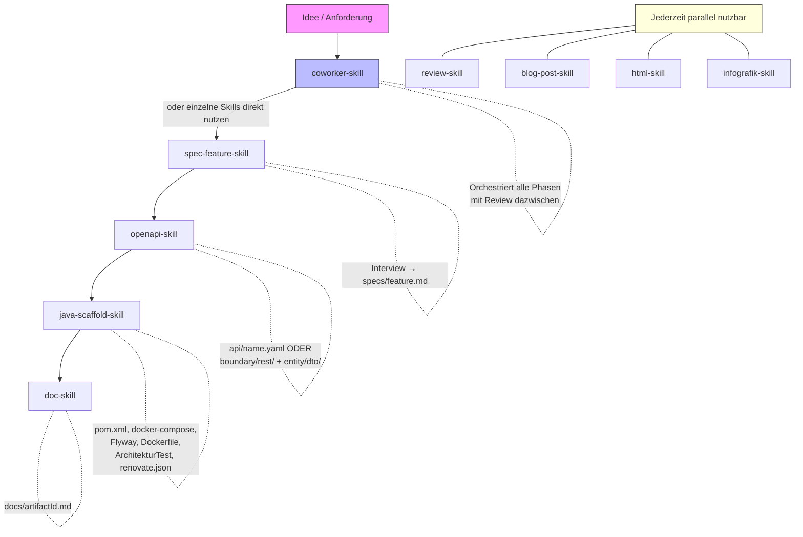

# Skills

Alle Skills liegen in `.claude/skills/` und werden von Claude Code automatisch geladen.
Sie steuern, wie Claude bei typischen Aufgaben vorgeht – als eingebettete Anweisungen,
nicht als externe Tools.

---

## Workflow-Übersicht



---

## coworker-skill

**Zweck:** Phasen-basierter Coworker fuer das End-to-End Setup neuer Projekte.
Orchestriert die bestehenden Skills in der richtigen Reihenfolge – mit Review
und Feedback-Moeglichkeit nach jeder Phase.

**Trigger:** `Starte den Coworker` · `Neues Projekt aufsetzen end-to-end` · `Coworker`

**Phasen:**

| Phase | Was passiert | Ergebnis |
|-------|-------------|----------|
| 1 – Projekt-Kontext | Framework, Dienste, Projektname | Grundlegende Entscheidungen |
| 2 – Feature spezifizieren | Delegiert an `spec-feature-skill` | `specs/<feature>.md` |
| 3 – API designen | Delegiert an `openapi-skill` (Modus A) | `api/<service>.yaml` |
| 4 – Code generieren | `java-scaffold-skill` + `openapi-skill` (Modus C) | Lauffaehiges Projekt |
| 5 – Zusammenfassung | Ueberblick + naechste Schritte | Empfehlungen |

**Flexibilitaet:**
- Jede Phase einzeln bestaetigbar – Review vor dem Weitermachen
- Phasen ueberspringbar, wenn Artefakte bereits existieren
- Jederzeit stoppbar – beim naechsten Aufruf erkennt der Coworker den Stand

---

## spec-feature-skill

**Zweck:** Strukturiertes Feature-Interview vor der Implementierung – erzeugt eine
Spec-Datei als gemeinsame Sprache zwischen Fachlichkeit und Code.

**Trigger:** `Ich möchte ein neues Feature spezifizieren`

**Ablauf:**

1. Interview in 4 Gruppen: Kontext → Verhalten → Technische Hinweise → Qualität
2. Zusammenfassung und Bestätigung
3. Ausgabe: `specs/<feature-name>.md`

**Output-Pfad:** `specs/<feature-name-kebab-case>.md`

---

## openapi-skill

**Zweck:** Erstellt, erweitert und implementiert OpenAPI 3.x Spezifikationen.
Unterstuetzt drei Modi: Spec erstellen, Spec erweitern und Code generieren.

**Trigger:** `Erstelle eine API Spec` · `Erweitere die API` · `Generiere Code aus der OpenAPI Spec`

**Modi:**

| Modus | Beschreibung | Ergebnis |
|-------|-------------|----------|
| A – Neue Spec erstellen | Interview: Datenmodelle, Endpunkte, Auth | `api/<name>.yaml` |
| B – Spec erweitern | Bestehende Spec einlesen, neue Paths/Schemas hinzufuegen | Erweiterte YAML |
| C – Code generieren | DTOs, Controller, Service-Stubs aus Spec | Java-Klassen im BCE-Pattern |

**Modus A/B – Spec erstellen/erweitern:**
- Bestehende Entities im Projekt werden erkannt und zur Uebernahme angeboten
- CRUD-Sets oder individuelle Endpunkte pro Ressource waehlbar
- Auth-Schema: Bearer JWT, API Key, OAuth2 oder keine

**Modus C – Code generieren:**
| Artefakt | Pfad | Beschreibung |
|----------|------|-------------|
| Controller / Resource | `boundary/rest/` | Ein File pro OpenAPI-Tag |
| DTOs | `entity/dto/` | Java Records mit Validation-Annotationen aus der Spec |
| Service-Stubs | `control/` | Leere Serviceklassen mit korrekten Methodensignaturen |

**Hinweis:** Wenn dieser Skill Code generiert hat, generiert `java-scaffold-skill`
`boundary/rest/` und `entity/dto/` **nicht** nochmal.

---

## java-scaffold-skill

**Zweck:** Erstellt den vollständigen Projekt-Rahmen für eine neue Java-Anwendung –
inklusive Build-Konfiguration, Infrastruktur und Architekturtests.

**Trigger:** `Erstelle ein neues Quarkus-Projekt`

**Pflichtabfragen:** groupId · artifactId · Framework · benötigte Dienste (DB / Messaging / Keycloak)

**Generiert:**
| Artefakt | Beschreibung |
|----------|-------------|
| `pom.xml` | Mit aktuellen Versionen (immer aus dem Internet abgefragt) |
| `docker-compose.yml` | Nur mit bestätigten Diensten |
| `application.properties` | Framework-spezifisch vorkonfiguriert |
| `Dockerfile` | Spring: Projekt-Root · Quarkus: `src/main/docker/` |
| `ArchitectureTest.java` | Taikai-basierte BCE-Regel-Prüfung |
| `renovate.json` | Automatische Dependency-Update-PRs |

**Versions-Pflicht:** Vor jeder Generierung werden aktuelle Versionen im Internet
abgefragt – niemals aus dem Gedächtnis.

---

## doc-skill

**Zweck:** Erstellt oder aktualisiert `docs/<artifactId>.md` auf Basis des bestehenden
Projekts – liest Quellcode und Konfiguration automatisch aus, bevor Fragen gestellt werden.

**Trigger:** `Dokumentiere das Projekt` · `Aktualisiere die Projektdokumentation`

**Automatisch analysiert:** `pom.xml` · `application.properties` · `docker-compose.yml` ·
REST-Endpunkte · Entities · Flyway-Migrationen · vorhandene Specs

**Verhalten bei vorhandener Datei:** Nur leere oder veraltete Abschnitte werden
aktualisiert – manuelle Ergänzungen bleiben erhalten.

**Adaptive Abschnitte:** API-Referenz, Messaging, Keycloak/Auth erscheinen nur,
wenn die jeweiligen Dependencies in der `pom.xml` aktiv sind.

---

## infografik-skill

**Zweck:** Generiert professionelle Infografiken als PNG-Datei über die
Hugging Face Inference API (FLUX.1, kostenlos mit `HF_TOKEN`).

**Trigger:** `Erstelle eine Infografik zu ...` · `Visualisiere das` · `Mach das übersichtlich`

**Voraussetzung:** `HF_TOKEN` als Umgebungsvariable auf dem Host gesetzt
(einmalige Einrichtung unter https://huggingface.co/settings/tokens)

---

## review-skill

**Zweck:** Systematisches Code-Review gegen Projekt-Konventionen, Architektur-Regeln
und Best Practices – mit automatischer Git-Status-Erkennung.

**Trigger:** `Prüfe den Code` · `Review die Änderungen` · `/review-skill src/main/java/`

**Dynamischer Kontext:** Beim Aufruf werden automatisch Staged Changes, Unstaged Changes,
Untracked Files und der aktuelle Branch injiziert – kein manuelles `git diff` nötig.

**Report-Kategorien:**
| Kategorie | Bedeutung |
|-----------|-----------|
| Kritisch | Sicherheitslücke, Datenverlust, Architektur-Verletzung |
| Warnung | Konventions-Verletzung, fehlender Test |
| Hinweis | Verbesserungsvorschlag, Stil |

**Prüfkatalog:** Detaillierte Regeln in [references/review-checklist.md](../. claude/skills/review-skill/references/review-checklist.md)

---

## blog-post-skill

**Zweck:** Erstellt technische Blog Posts als Markdown-Datei – basierend auf einem
strukturierten Interview mit Zielgruppen-Anpassung (Developer / BA / PM).

**Trigger:** `/blog-post-skill Quarkus und LangChain4j` · `Schreib einen Blog Post`

**Ablauf:**

1. Sprache wählen (Deutsch / Englisch)
2. Zielgruppe wählen (Developer / Business Analysts / Projekt Manager)
3. Themen-Interview (9 Fragen in 3 Gruppen)
4. Gliederung bestätigen
5. Blog Post generieren
6. Optional: Hero Image via Hugging Face FLUX

**Output-Pfad:** `docs/blog-<thema-kebab-case>.md`

**Hinweis:** `disable-model-invocation: true` – nur per `/blog-post-skill` aufrufbar,
Claude triggert ihn nicht automatisch.

---

## html-skill

**Zweck:** Erstellt einfache, responsive HTML-Seiten mit **Tailwind CSS** via CDN-Link.
Kein npm, kein Build-Tool – nur eine HTML-Datei.

**Trigger:** `Erstelle eine Landing Page` · `/html-skill Kontaktformular`

**Features:**

- Tailwind CSS via CDN (`<script src="https://cdn.tailwindcss.com">`)
- Mobile-first, responsive mit Breakpoints
- Semantisches HTML (`<header>`, `<main>`, `<footer>`)
- Barrierefreiheit (alt-Attribute, aria-labels)

**Speicherort je Kontext:**
| Kontext | Pfad |
|---------|------|
| Standalone | Projekt-Root |
| Spring Boot | `src/main/resources/static/` |
| Quarkus | `src/main/resources/META-INF/resources/` |

---

## Eigenen Skill erstellen

Skills folgen dem [Agent Skills](https://agentskills.io) Open Standard und der
[offiziellen Claude Code Dokumentation](https://code.claude.com/docs/en/skills).

### Schnellstart

1. **Verzeichnis anlegen:**

```bash
mkdir -p .claude/skills/mein-skill
```

2. **`SKILL.md` erstellen** – die einzige Pflichtdatei:

```yaml
---
name: mein-skill
description: Was der Skill tut und wann er verwendet wird. Claude nutzt diese Beschreibung um zu entscheiden, ob der Skill relevant ist.
argument-hint: "[parameter]"
---
# Mein Skill

Anweisungen, die Claude befolgt wenn der Skill aktiv ist.
## Instructions

### Schritt 1 – ...

### Schritt 2 – ...
```

3. **Testen** – zwei Wege:

```
# Claude entscheidet automatisch (wenn description passt)
Mach das, was mein Skill beschreibt

# Direkt aufrufen
/mein-skill optionale-argumente
```

### Verzeichnisstruktur

```
mein-skill/
├── SKILL.md              # Hauptanweisungen (Pflicht, max. 500 Zeilen)
├── templates/            # Templates zum Befüllen
│   └── output.md.template
├── references/           # Referenzmaterial (nur bei Bedarf geladen)
│   └── checklist.md
├── examples/             # Beispiel-Ausgaben
│   └── sample.md
└── scripts/              # Ausführbare Skripte
    └── helper.sh
```

Supporting Files werden aus `SKILL.md` heraus **mit relativen Links** referenziert:

```markdown
## Additional resources

- Für das Ausgabe-Template, siehe [templates/output.md.template](templates/output.md.template)
- Für die Prüfregeln, siehe [references/checklist.md](references/checklist.md)
```

### Frontmatter-Referenz

Alle Felder sind optional. Nur `description` wird empfohlen.

| Feld                       | Beschreibung                                                                                   |
| -------------------------- | ---------------------------------------------------------------------------------------------- |
| `name`                     | Skill-Name, wird zum `/slash-command`. Kleinbuchstaben, Zahlen, Bindestriche (max 64 Zeichen). |
| `description`              | Was der Skill tut + wann er verwendet wird. Claude nutzt dies zur Entscheidung.                |
| `argument-hint`            | Autocomplete-Hinweis, z.B. `[datei]` oder `[framework] [name]`                                 |
| `disable-model-invocation` | `true` → nur per `/name` aufrufbar, Claude triggert nicht automatisch                          |
| `user-invocable`           | `false` → nicht im `/`-Menü sichtbar, nur als Hintergrundwissen für Claude                     |
| `allowed-tools`            | Tools die Claude ohne Rückfrage nutzen darf, z.B. `Read, Grep, Glob`                           |
| `model`                    | Modell das bei diesem Skill verwendet wird                                                     |
| `context`                  | `fork` → läuft in isoliertem Subagent (ohne Gesprächskontext)                                  |
| `agent`                    | Subagent-Typ bei `context: fork`, z.B. `Explore`, `Plan`, `general-purpose`                    |

### String-Substitutionen

| Variable               | Beschreibung                                               |
| ---------------------- | ---------------------------------------------------------- |
| `$ARGUMENTS`           | Alle übergebenen Argumente (`/skill-name diese argumente`) |
| `$ARGUMENTS[N]`        | N-tes Argument (0-basiert), z.B. `$ARGUMENTS[0]`           |
| `$N`                   | Kurzform für `$ARGUMENTS[N]`, z.B. `$0`, `$1`              |
| `${CLAUDE_SESSION_ID}` | Aktuelle Session-ID                                        |

### Dynamic Context Injection

Shell-Befehle werden **vor** dem Skill ausgeführt und deren Ausgabe eingesetzt:

```markdown
## Aktueller Status

- Branch: !`git branch --show-current`
- Änderungen: !`git diff --name-only`
```

Claude sieht nur das Ergebnis, nicht den Befehl.

### Wer darf was?

| Frontmatter                      | User kann aufrufen | Claude kann aufrufen |
| -------------------------------- | ------------------ | -------------------- |
| _(Standard)_                     | Ja                 | Ja                   |
| `disable-model-invocation: true` | Ja                 | Nein                 |
| `user-invocable: false`          | Nein               | Ja                   |

### Projekt-Template verwenden

Das Template `.claude/skills/SKILL.md.template` enthält die Grundstruktur für neue Skills
mit allen Konventionen dieses Projekts:

```bash
cp .claude/skills/SKILL.md.template .claude/skills/mein-skill/SKILL.md
```

Dann die Platzhalter (`{{...}}`) ersetzen und anpassen.

### Skill in CLAUDE.md registrieren

Neuen Skill in der Skill-Tabelle in `CLAUDE.md` eintragen:

```markdown
| `mein-skill` | Kurzbeschreibung wann der Skill verwendet wird |
```

### Checkliste für neue Skills

- [ ] `SKILL.md` mit einzeiliger `description` im Frontmatter
- [ ] `argument-hint` wenn der Skill Parameter akzeptiert
- [ ] `disable-model-invocation: true` wenn der Skill Seiteneffekte hat
- [ ] Supporting Files mit relativen Links referenziert
- [ ] SKILL.md unter 500 Zeilen (Details in separate Dateien auslagern)
- [ ] In `CLAUDE.md` Skill-Tabelle eingetragen
- [ ] Getestet: `/mein-skill` und automatische Erkennung
