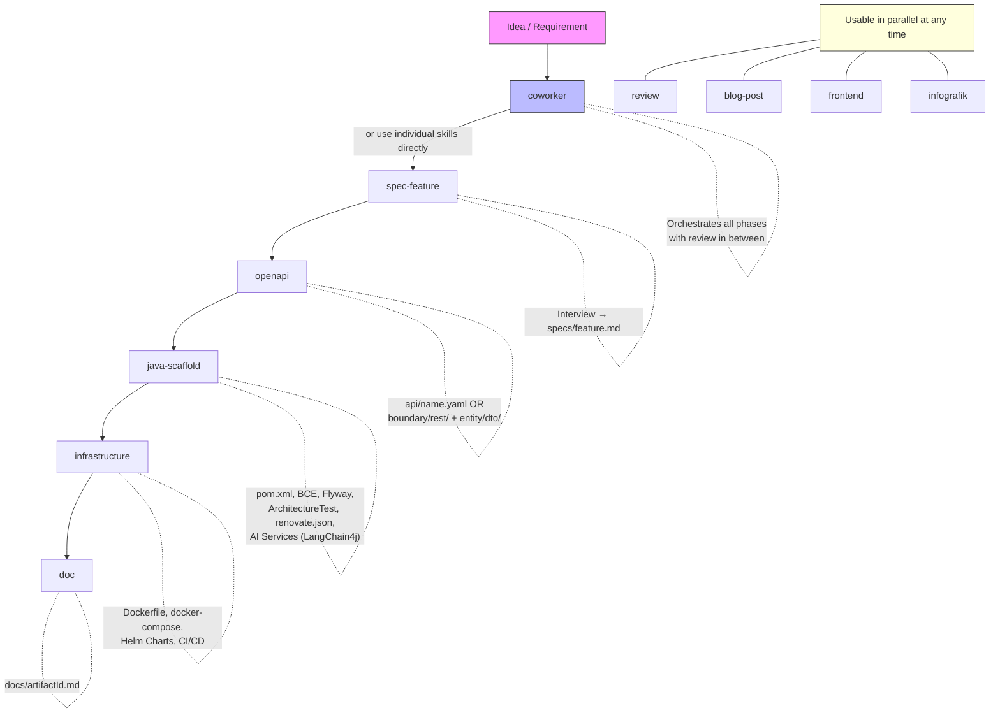

# Skills

All skills are located in `.claude/skills/` and are automatically loaded by Claude Code.
They control how Claude approaches typical tasks – as embedded instructions,
not as external tools.

---

## Workflow Overview



---

## coworker

**Purpose:** Phase-based coworker for end-to-end setup of new projects.
Orchestrates existing skills in the correct order – with review
and feedback opportunity after each phase.

**Trigger:** `Start the Coworker` · `Set up a new project end-to-end` · `Coworker`

**Phases:**

| Phase | What happens | Result |
|-------|-------------|--------|
| 1 – Project Context | Framework, services, project name | Fundamental decisions |
| 2 – Specify Feature | Delegates to `spec-feature` | `specs/<feature>.md` |
| 3 – Design API | Delegates to `openapi` (Mode A) | `api/<service>.yaml` |
| 4 – Generate Code | `java-scaffold` + `openapi` (Mode C) | Runnable project |
| 5 – Summary | Overview + next steps | Recommendations |

**Flexibility:**
- Each phase can be confirmed individually – review before proceeding
- Phases can be skipped if artifacts already exist
- Can be stopped at any time – on the next call, the coworker recognizes the current state

---

## spec-feature

**Purpose:** Structured feature interview before implementation – produces a
spec file as a shared language between business requirements and code.

**Trigger:** `I want to specify a new feature`

**Process:**

1. Interview in 4 groups: Context → Behavior → Technical Hints → Quality
2. Summary and confirmation
3. Output: `specs/<feature-name>.md`

**Output path:** `specs/<feature-name-kebab-case>.md`

---

## openapi

**Purpose:** Creates, extends, and implements OpenAPI 3.x specifications.
Supports three modes: create spec, extend spec, and generate code.

**Trigger:** `Create an API spec` · `Extend the API` · `Generate code from the OpenAPI spec`

**Modes:**

| Mode | Description | Result |
|------|-------------|--------|
| A – Create new spec | Interview: data models, endpoints, auth | `api/<name>.yaml` |
| B – Extend spec | Read existing spec, add new paths/schemas | Extended YAML |
| C – Generate code | DTOs, controllers, service stubs from spec | Java classes in BCE pattern |

**Mode A/B – Create/extend spec:**
- Existing entities in the project are detected and offered for adoption
- CRUD sets or individual endpoints per resource are selectable
- Auth schema: Bearer JWT, API Key, OAuth2, or none

**Mode C – Generate code:**
| Artifact | Path | Description |
|----------|------|-------------|
| Controller / Resource | `boundary/rest/` | One file per OpenAPI tag |
| DTOs | `entity/dto/` | Java Records with validation annotations from the spec |
| Service stubs | `control/` | Empty service classes with correct method signatures |

**Note:** If this skill has generated code, `java-scaffold`
will **not** generate `boundary/rest/` and `entity/dto/` again.

---

## java-scaffold

**Purpose:** Creates the complete project framework for a new Java application –
including build configuration, architecture tests, and optionally AI integration
via LangChain4j. For Dockerfiles, docker-compose, and infrastructure, use the `infrastructure` skill.

**Trigger:** `Create a new Quarkus project` · `AI Service` · `Chatbot` · `RAG` · `LangChain4j`

**Required queries:** groupId · artifactId · Framework · required services (DB / Messaging / Keycloak) · AI support (optional)

**Generates:**
| Artifact | Description |
|----------|-------------|
| `pom.xml` | With current versions (always queried from the internet) |
| `application.properties` | Framework-specific preconfigured |
| `ArchitectureTest.java` | Taikai-based BCE rule validation (incl. AI layer rules) |
| `renovate.json` | Automatic dependency update PRs |

**AI Support (optional, Quarkus + LangChain4j):**
| Artifact | Description |
|----------|-------------|
| AI Service (`boundary/ai/`) | `@RegisterAiService` interface with system/user prompt |
| AI Tools (`control/ai/`) | `@Tool` classes for function calling |
| RAG Pipeline (`control/ai/`) | Document ingestion + RetrievalAugmentor with PgVector |
| Guardrails (`control/ai/`) | Input/output validation |
| Agents (`boundary/ai/`) | Autonomous agents with workflow patterns |
| Fault Tolerance | `@Timeout`, `@Retry`, `@Fallback` for production |
| `docker-compose-ai.yml` | PgVector + optional Ollama |

**AI Profiles:** Chat · Chat + Tools · Chat + RAG · Chat + Guardrails · Agentic · Fault Tolerant · Complete

**Version requirement:** Before each generation, current versions are queried
from the internet – never from memory.

---

## infrastructure

**Purpose:** Infrastructure scaffolding for Java projects – Dockerfiles, docker-compose,
Helm Charts, and CI/CD pipelines. Reads existing project configuration to detect
framework, services, and health endpoints automatically.

**Trigger:** `Create a Dockerfile` · `docker-compose` · `Helm chart` · `CI/CD pipeline` · `Infrastructure`

**Generates:**
| Artifact | Description |
|----------|-------------|
| `Dockerfile` | Multi-stage build with health checks, non-root user |
| `docker-compose.yml` | All required services with health checks and volumes |
| Helm Charts | Kubernetes deployment manifests (future) |
| CI/CD pipelines | GitHub Actions, GitLab CI (future) |

**Behavior:** Reads `pom.xml` and `application.properties` first – never guesses
framework or services. Uses templates from `templates/spring/` or `templates/quarkus/`.

---

## doc

**Purpose:** Creates or updates `docs/<artifactId>.md` based on the existing
project – automatically reads source code and configuration before asking questions.

**Trigger:** `Document the project` · `Update the project documentation`

**Automatically analyzed:** `pom.xml` · `application.properties` · `docker-compose.yml` ·
REST endpoints · Entities · Flyway migrations · existing specs

**Behavior with existing file:** Only empty or outdated sections are
updated – manual additions are preserved.

**Adaptive sections:** API reference, messaging, Keycloak/Auth appear only
when the respective dependencies are active in the `pom.xml`.

---

## infografik

**Purpose:** Generates professional infographics as PNG files via the
Hugging Face Inference API (FLUX.1, free with `HF_TOKEN`).

**Trigger:** `Create an infographic about ...` · `Visualize this` · `Make this clear and visual`

**Prerequisite:** `HF_TOKEN` set as environment variable on the host
(one-time setup at https://huggingface.co/settings/tokens)

---

## review

**Purpose:** Systematic code review against project conventions, architecture rules,
and best practices – with automatic Git status detection.

**Trigger:** `Check the code` · `Review the changes` · `/review src/main/java/`

**Dynamic context:** On invocation, staged changes, unstaged changes,
untracked files, and the current branch are automatically injected – no manual `git diff` needed.

**Report categories:**
| Category | Meaning |
|----------|---------|
| Critical | Security vulnerability, data loss, architecture violation |
| Warning | Convention violation, missing test |
| Note | Improvement suggestion, style |

**Review catalog:** Detailed rules in [references/review-checklist.md](../. claude/skills/review/references/review-checklist.md)

---

## blog-post

**Purpose:** Creates technical blog posts as Markdown files – based on a
structured interview with audience adaptation (Developer / BA / PM).

**Trigger:** `/blog-post Quarkus and LangChain4j` · `Write a blog post`

**Process:**

1. Choose language (German / English)
2. Choose audience (Developer / Business Analysts / Project Manager)
3. Topic interview (9 questions in 3 groups)
4. Confirm outline
5. Generate blog post
6. Optional: Hero image via Hugging Face FLUX

**Output path:** `docs/blog-<topic-kebab-case>.md`

**Note:** `disable-model-invocation: true` – only callable via `/blog-post`,
Claude does not trigger it automatically.

---

## frontend

**Purpose:** Creates modern web UIs with **Tailwind CSS**. Three modes: Simple HTML pages (no JS),
Dashboards/Admin panels with TailAdmin (Alpine.js + ApexCharts), and Websites/Landing Pages with Tailwind CSS CDN.

**Trigger:** `Create a dashboard` · `Landing page` · `Admin UI` · `Frontend` · `Simple HTML page` · `Static page`

**Modes:**
| Mode | Stack | Description |
|------|-------|-------------|
| Simple | HTML + Tailwind CSS CDN | Static pages, forms, quick prototypes (no JavaScript) |
| Dashboard / Admin Panel | TailAdmin + Alpine.js + ApexCharts | Data-driven UIs with charts, tables, forms |
| Website / Landing Page | Tailwind CSS CDN | Responsive pages without build tools |

**Features:**

- Tailwind CSS (CDN or TailAdmin)
- Mobile-first, responsive with breakpoints
- Semantic HTML (`<header>`, `<main>`, `<footer>`)
- Accessibility (alt attributes, aria-labels)

**Storage location by context:**
| Context | Path |
|---------|------|
| Standalone | Project root |
| Spring Boot | `src/main/resources/static/` |
| Quarkus | `src/main/resources/META-INF/resources/` |

---

## Creating Your Own Skill

Skills follow the [Agent Skills](https://agentskills.io) Open Standard and the
[official Claude Code documentation](https://code.claude.com/docs/en/skills).

### Quick Start

1. **Create directory:**

```bash
mkdir -p .claude/skills/my-skill
```

2. **Create `SKILL.md`** – the only required file:

```yaml
---
name: my-skill
description: What the skill does and when it is used. Claude uses this description to decide whether the skill is relevant.
argument-hint: "[parameter]"
---
# My Skill

Instructions that Claude follows when the skill is active.
## Instructions

### Step 1 – ...

### Step 2 – ...
```

3. **Test** – two ways:

```
# Claude decides automatically (if description matches)
Do what my skill describes

# Call directly
/my-skill optional-arguments
```

### Directory Structure

```
my-skill/
├── SKILL.md              # Main instructions (required, max 500 lines)
├── templates/            # Templates to fill in
│   └── output.md.template
├── references/           # Reference material (loaded only when needed)
│   └── checklist.md
├── examples/             # Example outputs
│   └── sample.md
└── scripts/              # Executable scripts
    └── helper.sh
```

Supporting files are referenced from `SKILL.md` **with relative links**:

```markdown
## Additional resources

- For the output template, see [templates/output.md.template](templates/output.md.template)
- For the review rules, see [references/checklist.md](references/checklist.md)
```

### Frontmatter Reference

All fields are optional. Only `description` is recommended.

| Field                      | Description                                                                                    |
| -------------------------- | ---------------------------------------------------------------------------------------------- |
| `name`                     | Skill name, becomes the `/slash-command`. Lowercase, numbers, hyphens (max 64 characters).     |
| `description`              | What the skill does + when it is used. Claude uses this for decision-making.                   |
| `argument-hint`            | Autocomplete hint, e.g. `[file]` or `[framework] [name]`                                      |
| `disable-model-invocation` | `true` → only callable via `/name`, Claude does not trigger automatically                      |
| `user-invocable`           | `false` → not visible in the `/` menu, only as background knowledge for Claude                 |
| `allowed-tools`            | Tools that Claude may use without confirmation, e.g. `Read, Grep, Glob`                        |
| `model`                    | Model used for this skill                                                                      |
| `context`                  | `fork` → runs in isolated sub-agent (without conversation context)                             |
| `agent`                    | Sub-agent type for `context: fork`, e.g. `Explore`, `Plan`, `general-purpose`                  |

### String Substitutions

| Variable               | Description                                                |
| ---------------------- | ---------------------------------------------------------- |
| `$ARGUMENTS`           | All passed arguments (`/skill-name these arguments`)       |
| `$ARGUMENTS[N]`        | N-th argument (0-based), e.g. `$ARGUMENTS[0]`              |
| `$N`                   | Short form for `$ARGUMENTS[N]`, e.g. `$0`, `$1`            |
| `${CLAUDE_SESSION_ID}` | Current session ID                                         |

### Dynamic Context Injection

Shell commands are executed **before** the skill and their output is substituted:

```markdown
## Current Status

- Branch: !`git branch --show-current`
- Changes: !`git diff --name-only`
```

Claude only sees the result, not the command.

### Who Can Do What?

| Frontmatter                      | User can invoke | Claude can invoke |
| -------------------------------- | --------------- | ----------------- |
| _(Default)_                      | Yes             | Yes               |
| `disable-model-invocation: true` | Yes             | No                |
| `user-invocable: false`          | No              | Yes               |

### Using the Project Template

The template `.claude/skills/SKILL.md.template` contains the basic structure for new skills
with all conventions of this project:

```bash
cp .claude/skills/SKILL.md.template .claude/skills/my-skill/SKILL.md
```

Then replace and adapt the placeholders (`{{...}}`).

### Register Skill in CLAUDE.md

Add the new skill to the skill table in `CLAUDE.md`:

```markdown
| `my-skill` | Brief description of when the skill is used |
```

### Checklist for New Skills

- [ ] `SKILL.md` with one-line `description` in frontmatter
- [ ] `argument-hint` if the skill accepts parameters
- [ ] `disable-model-invocation: true` if the skill has side effects
- [ ] Supporting files referenced with relative links
- [ ] SKILL.md under 500 lines (move details to separate files)
- [ ] Added to `CLAUDE.md` skill table
- [ ] Tested: `/my-skill` and automatic recognition
